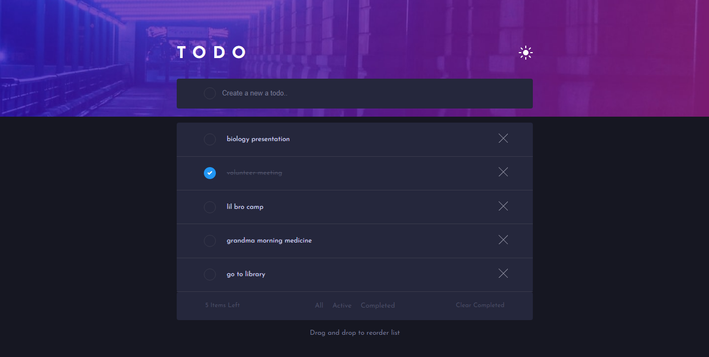

# Frontend Mentor - Todo app solution

This is a solution to the [Todo app challenge on Frontend Mentor](https://www.frontendmentor.io/challenges/todo-app-Su1_KokOW). Frontend Mentor challenges help you improve your coding skills by building realistic projects. 

## Table of contents

- [Overview](#overview)
  - [The challenge](#the-challenge)
  - [Screenshot](#screenshot)
  - [Links](#links)
- [My process](#my-process)
  - [Built with](#built-with)
  - [What I learned](#what-i-learned)
  - [Continued development](#continued-development)
  - [Useful resources](#useful-resources)
- [Author](#author)


## Overview

### The challenge

Users should be able to:

- View the optimal layout for the app depending on their device's screen size
- See hover states for all interactive elements on the page
- Add new todos to the list
- Mark todos as complete
- Delete todos from the list
- Filter by all/active/complete todos
- Clear all completed todos
- Toggle light and dark mode
- **Bonus**: Drag and drop to reorder items on the list

### Screenshot





### Links

- Solution URL: [Github](https://github.com/Giska123/TodoApp-challange)
- Live Site URL: [Vercel](https://todo-app-challange.vercel.app/)

## My process

### Built with

- [React](https://reactjs.org/) - JS library
- [Express](https://expressjs.com/) - Open-source Node.js web application framework


### What I learned

```css
.checkbox-circle input[type="checkbox"]:checked + .checkmark:after {
    display: block;
}
```
```js
for (const span of spans) {
      span.addEventListener("click", function() {
          for (const otherSpan of spans) {
              otherSpan.classList.remove("active");
          }
          this.classList.add("active");
      });
  }

    const handleDragStart = (e, index) => {
      e.dataTransfer.setData("index", index);
    };
  
    const handleDrop = (e, index) => {
      e.preventDefault();
      const dragIndex = e.dataTransfer.getData("index");
      const dragActivity = activities[dragIndex];
      let newActivities = [...activities];
      newActivities.splice(dragIndex, 1);
      newActivities.splice(index, 0, dragActivity);
      setActivities(newActivities);
    };
  
    const handleTouchStart = (e, index) => {
      e.target.setAttribute("data-index", index);
    };
    
    const handleTouchEnd = (e, index) => {
      const dragIndex = e.target.getAttribute("data-index");
      const dragActivity = activities[dragIndex];
      let newActivities = [...activities];
      newActivities.splice(dragIndex, 1);
      newActivities.splice(index, 0, dragActivity);
      setActivities(newActivities);
    };
```


### Continued development

i have learnt the concept about API, i want learn more about nested json, how to fetch them so can work properly. 

### Useful resources

- [chatGPT]([https://www.example.com](https://openai.com/blog/chatgpt/)) - This helped me for understanding the problems and errors and how to learn and give understanding about the problem's and error's resolve.


## Author

- Website - [https://giska-portfolio.netlify.app/)
- Frontend Mentor - [@Giska123]([https://www.frontendmentor.io/profile/yourusername](https://www.frontendmentor.io/profile/Giska123))


